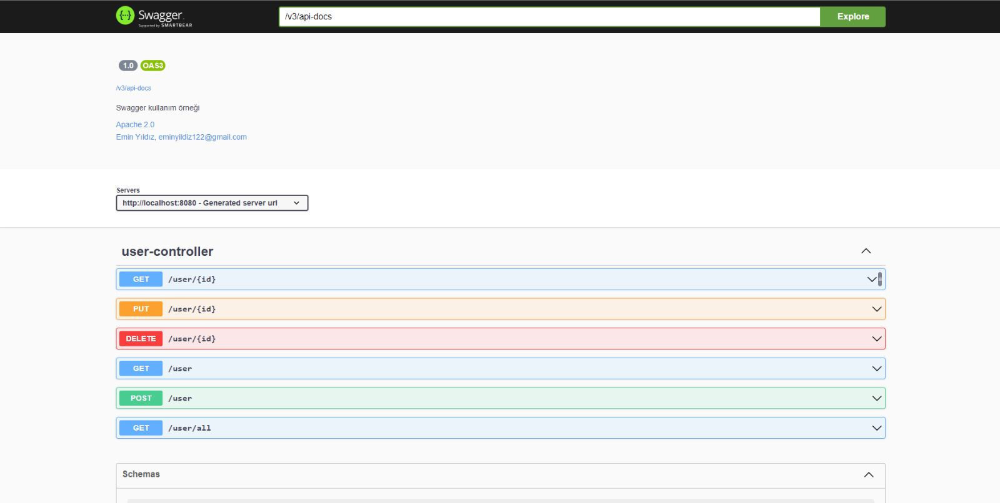

# Rest(Representational State Transfer)

- Web servis oluşturmak için kullanılan web servis yöntemlerinden birisidir.
- programlama dilinden bağımsız olarak web servis oluşturmak için kullanılan bir yapıdır.
- HTTP protokolüne ait HTTP yöntemlerini ve HTTP durum kodlarını kullanarak gelen isteklere XML, JSON, CSV vb. olarak cevap verir.

## HTTP Yöntemleri

| Yöntem     | Tanım                                                   |
|------------|---------------------------------------------------------|
| **GET**    | Verileri almak için kullanılır.                         |
| **POST**   | Veri göndermek/eklemek için kullanılır.                 |
| **DELETE** | Verileri silmek için kullanılır.                        |
| **PUT**    | Veriler üzerinde değişiklik yapmak için kullanılır.     |

## Richardson Maturity Model

Rest'de kullanılan her bir metod standartlaşmıştır. Richardson Maturity Model bu standartları oluşturur. 3 kriterden oluşur ve bu kriterleri sağlayıp sağlamamasına yönelik 4 katmanlı bir piramit oluşturmuştur.


- Level-0 (POX Swamp): Sadece tek bir method(Post) ve tek bir URI üzerinden haberleşen servislerin bulunduğu en alt katmandır. sadece bir service üzerinden bütün işlemleri gerçekleştirmektir bu da yanlış bir şeydir.
- Level-1 (URI): Her bir resource için ayrı bir URI olup yine bütün isteklerin tek bir method(Post) ile haberleştiği servislerin yer aldığı olgunluk katmanıdır. Örnek uri kullanımı "www.blabla.com/categories/2/populer-stories/3".
- Level-2 (HTTP): HTTP metodlarının devreye girdiği katmandır.
- Level-3 (HYPERMEDIA): Bu katmanın kısaca mantığı şudur; response olarak döndüğün veriyle birlikte bu resource ile yapabileceği diğer işlemlerin URI’lerini de istemciye geri dön böylelikle apilerimizi çağıran tarafı hem yönlendirmiş oluruz hem de bu resource üzerinde başka neler yapabileceğini göstermiş oluruz.
- (Hateoas)(Hypermedia As The Engine Of Application State): Bir response'un içine api'de bulunan bütün uç bilgilerinde karşı tarafa iletilmesi.

## API Türleri

API'ler, iki yazılım bileşeninin belirli tanımlar ve protokoller aracılığıyla birbiriyle iletişim kurmasına olanak tanıyan mekanizmalardır. Örneğin, meteoroloji müdürlüğünün yazılım sistemi, günlük hava durumu verilerini içerir. Telefonunuzdaki hava durumu uygulaması, API'ler aracılığıyla bu sistemle "konuşur" ve telefonunuzda size günlük hava durumu güncellemelerini gösterir. API'ler dört'e ayrılır.

- **Open API(Public API)**: Minimum kısıtlama ile geliştiriciler ve diğer kullanıcılar tarafından herkesin kullanımına açık API'lerdir. Kayıt, API Anahtarı veya OAuth kullanımını gerektirebilir veya tamamen açık olabilirler.
- **Internal API(Private API)**: Harici kullanıcılardan gizlenir ve yalnızca dahili sistemler tarafından açığa çıkarılır.
- **Partner API**: Stratejik iş ortaklarına veya stratejik iş ortakları tarafından sunulan API'lerdir.
- **Composite API**: Composite API'ler birden çok veri veya hizmet API'sini birleştiren API'lerdir.

## Swagger

Swagger, API tasarlamaya, oluşturmaya, belgelendirmeye ve kullanmaya yardımcı olabilecek OpenAPI şartnamesi etrafında oluşturulmuş açık kaynaklı araçtır. Swagger’ın en önemli amacı Rest API için bir arayüz sağlamaktır.

```xml
<dependency>
    <groupId>org.springdoc</groupId>
    <artifactId>springdoc-openapi-starter-webmvc-ui</artifactId>
    <version>2.1.0</version>
</dependency>
```



### Swagger Config

```java
@Configuration
public class SwaggerConfig {

    @Bean
    public OpenAPI awesomeAPI() {
        return new OpenAPI()
                .info(new Info().title("")
                        .description("Swagger kullanım örneği")
                        .version("1.0")
                        .license(new License().name("Apache 2.0").url("http://www.apache.org/licenses/LICENSE-2.0")))
                        .externalDocs(new ExternalDocumentation()
                        .description("Emin Yıldız, eminyildiz122@gmail.com")
                        .url("https://github.com/Emin-Yildiz"));
    }
}
```

## Rest Template

RestTemplate, Spring Boot Web kütüphanesinin içerisinde yer alan bir yapıdır. Spring projelerimizde HTTP isteklerini yapıp yönetebilmemizi sağlar. Spring Boot projelerinde HTTP isteklerini yönetmek için kullanılan bir sınıftır. Bu sınıf, RESTful web servislerine HTTP istekleri göndermek ve cevapları almak için kullanılır. 

Rest template içerisinde aşağıdaki özellikler yer alır.

- getForObject
- getForEntity
- postForEntity
- postForObject

Örnek uygulamamız içinde aşağıdaki api'yi kullanıcaz.

```url
https://rickandmortyapi.com/api/character
```

Spring projemizin her yerinde RestTemplate ve HttpHeaders'ı kullanabilmek için instance oluşturmalıyız, bunu application class içerisinde yapabiliriz.

```java
@Bean
public RestTemplate restTemplate() {
    return new RestTemplate();
}

@Bean
public HttpHeaders httpHeaders() {
    return new HttpHeaders();
}
```
